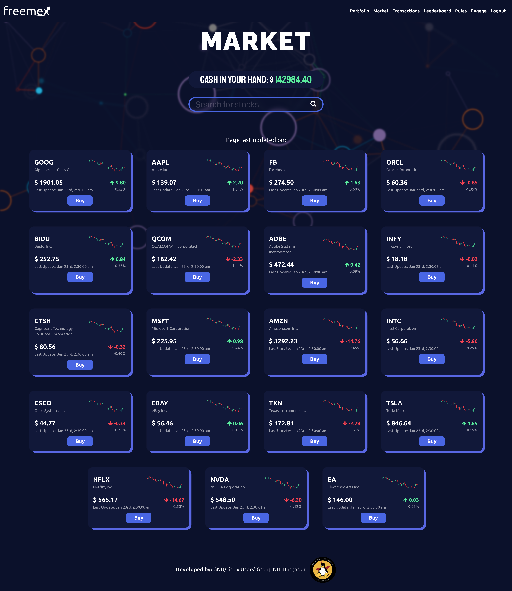
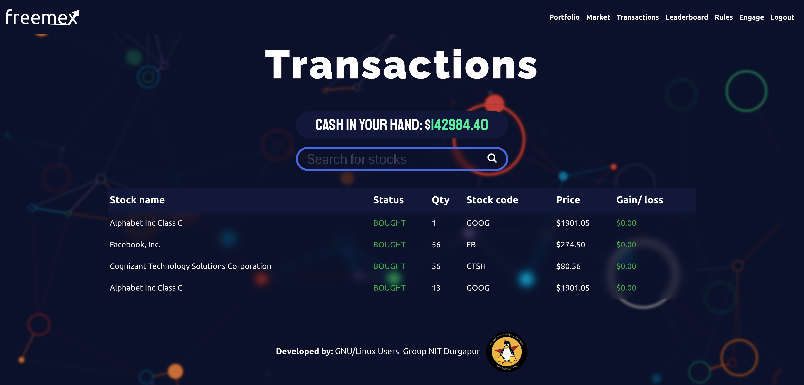

# Freemex 3.0

A stock market simulation 📈

## Stack
| Part      | Stack                                                                                                                                              |
| :-------- | :------------------------------------------------------------------------------------------------------------------------------------------------- |
| Frontend  | [`React`](https://reactjs.org/), [`Redux`](https://redux.js.org/), [`Node`](https://nodejs.org/)                                                   |
| Backend   | [`PostgreSQL`](https://www.postgresql.org/), [`Express`](https://expressjs.com/), [`Socket.io`](https://socket.io/), [`Node`](https://nodejs.org/) |

## Requirements

* node - https://nodejs.org/en/download/
* npm

## Getting started

* Clone repo and move into the Freemex2.0 directory

* install dependencies
`npm install`

* create .env file and fill it up with required values from .env.example

* get Google client id and client secret from https://console.developers.google.com/
* get Github client id and client secret from https://github.com/settings/applications/new

* add these credentials to .env file

* start server
`npm start`

* Go to http://localhost:{your PORT}/timer/entry and enter the username and password from your .env file when prompted

* Add the timer values

* Go to http://localhost:{your PORT} and start investing!


## Deployment

### Deploying on Heroku

* Create a Heroku account at https://signup.heroku.com/login and download the Heroku CLI from https://devcenter.heroku.com/articles/getting-started-with-nodejs#set-up.

* Login to Heroku using `heroku login -i` and providing your login credentials.

* Change directory to the root of the project and define a Procfile, which would include explicit instructions to the start the application once it is deployed. In our case the Procfile would look something like this: `web: npm start`, which executes the command `node index.js`.

* Deploy the app using the Heroku CLI tools by executing the following:
```
heroku create <project-name>
git push heroku master
```

* To ensure atleast one instance of the app is running, run `heroku ps:scale web=1`.

* Configure the environment variables by using `heroku config:set <name of variable>=<value of variable>`.

* Set up a free MongoDB Atlas account at https://www.mongodb.com/cloud/atlas and configure the database URL.

* To open the app on the browser, run `heroku open`.

* If there are any errors, they can be inspected using `heroku logs --tail`.

## Glimpses into the project





